## Apache JMeter configuration for load testing of RMS Public API infrastructure

> This configuration is made for load testing of RMS Public API infrastructure. The configuration is made taking into account both local launch and launch via Azure Load Testing. 

> At the time of writing the script has failed to work in both local and **Azure Load Testing** environments. The problem is observed with variables which values should control thread start parameters (_Thread_). 
-----
Table of contents
- [Apache JMeter configuration for load testing of RMS Public API infrastructure](#apache-jmeter-configuration-for-load-testing-of-rms-public-api-infrastructure)
- [Default environment configuration](#default-environment-configuration)
- [Azure LT environment configurations](#azure-lt-environment-configurations)
- [Check Azure LT environment for configurations](#check-azure-lt-environment-for-configurations)
- [Default Threads Running Properties](#default-threads-running-properties)
- [Azure LT environment Threads Testing Properties](#azure-lt-environment-threads-testing-properties)
	- [Table of variables that can be defined via **Azure Load Testing** environment](#table-of-variables-that-can-be-defined-via-azure-load-testing-environment)
- [Check Azure LT environment for Thread Properties](#check-azure-lt-environment-for-thread-properties)
- [Get AAD Authorization Token — gAuthToken](#get-aad-authorization-token--gauthtoken)
- [Assets testing — asts Threading Group](#assets-testing--asts-threading-group)
	- [Prepare request path scripts](#prepare-request-path-scripts)
	- [The parsers of the responses returned by requests](#the-parsers-of-the-responses-returned-by-requests)
	- [Iterators of requests](#iterators-of-requests)
- [Streaming Policies and Locators Testing — spl Threading Group](#streaming-policies-and-locators-testing--spl-threading-group)
	- [The script of translation of global variables to local scope](#the-script-of-translation-of-global-variables-to-local-scope)
- [Transforms and Jobs Threading Group](#transforms-and-jobs-threading-group)
- [Information on metrics](#information-on-metrics)
-----

## 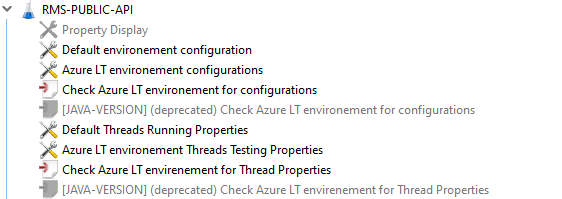

There are 4 User Defined Variable modules included in the project structure.

## Default environment configuration

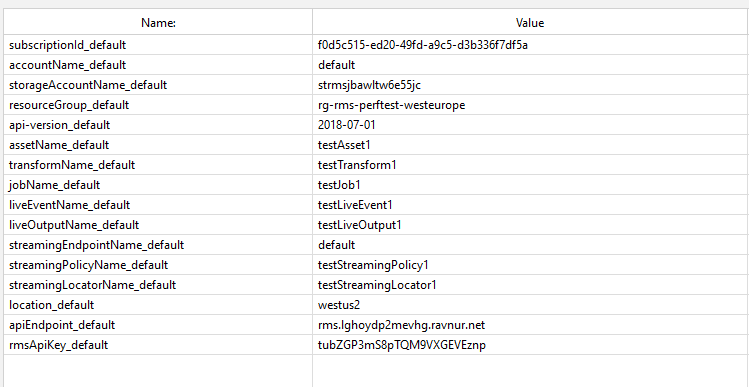

The **Default environment configuration** module contains default values for variables used in requests to the **RMS Public API**. It should be mentioned that some of these variables were not used in this configuration. For example, the ***assetName***, ***transformName*** and ***jobName*** variables were ignored because using a single value to perform a load test was not sufficient. This configuration uses a random character string generator to create values for these three variables. 
Also, the **AccessToken** variable has been removed from this module and is subsequently defined as a _Apache JMeter_ variable in the global scope. 

[Top](#table-of-contents)

## Azure LT environment configurations

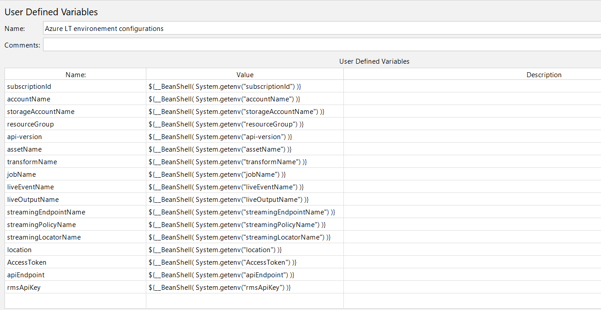

The **Azure LT environment configurations** module defines the names of the variables that were directly used to write this _Apache JMeter_ configuration. The values for these variables are taken from the **Azure Load Testing** environment. When this configuration is run locally, the values of these variables are set to ***null***. 

[Top](#table-of-contents)

## Check Azure LT environment for configurations

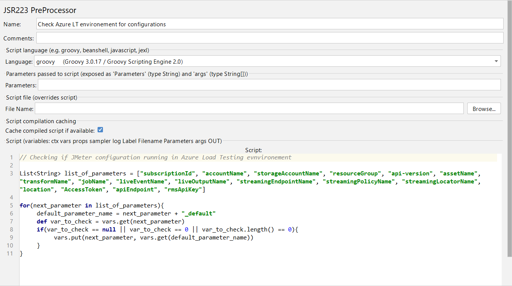


The **Check Azure LT environment for configurations** module implements a script to check the launch of a configuration in the **Azure Load Testing** environment. 

```groovy
// Checking if JMeter configuration running in Azure Load Testing environment

List<String> list_of_parameters = ["subscriptionId", "accountName", "storageAccountName", "resourceGroup", "api-version", "assetName", "transformName", "jobName", "liveEventName", "liveOutputName", "streamingEndpointName", "streamingPolicyName", "streamingLocatorName", "location", "AccessToken", "apiEndpoint", "rmsApiKey"]

for(next_parameter in list_of_parameters){
	default_parameter_name = next_parameter + "_default"
	def var_to_check = vars.get(next_parameter)
	if(var_to_check == null || var_to_check == 0 || var_to_check.length() == 0){
		vars.put(next_parameter, vars.get(default_parameter_name))
	}
}
```

The script checks the values of variables from **Azure LT environment configurations** and if this configuration is run locally, the values are substituted from the **Default environment configuration** module.

[Top](#table-of-contents)

## Default Threads Running Properties

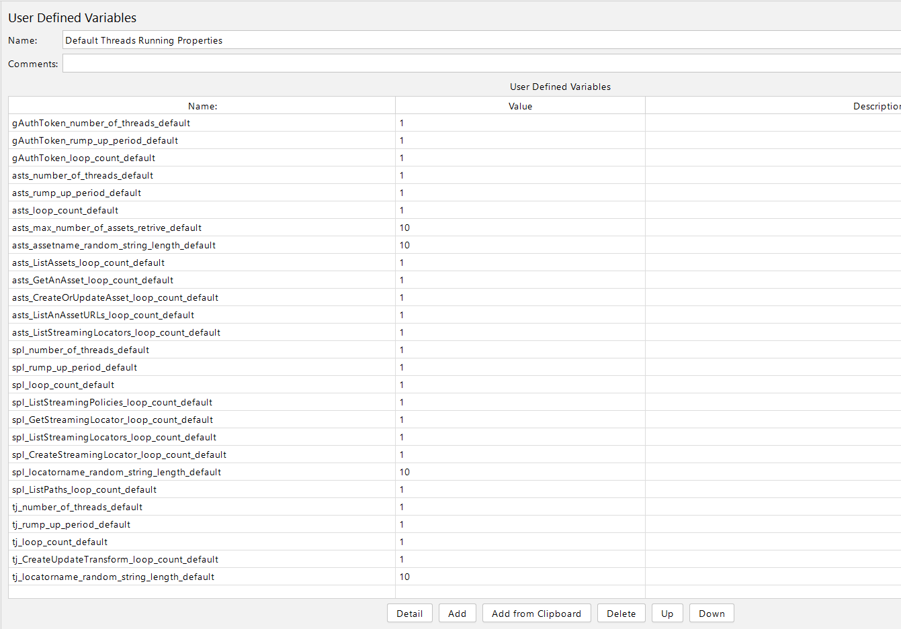

The **Default Threads Running Properties** module defines the default values of the variables to control the testing flow. The variables ***gAuthToken_number_of_threads_default***, ***gAuthToken_rump_up_period_default***, ***gAuthToken_loop_count_default*** have only default values and cannot be defined through the **Azure Load Testing** framework, since the **gAuthToken** stage is declared as **setUp Thread** and is started for the purpose of obtaining an authorization token that will be used to execute authorized requests. 

[Top](#table-of-contents)

## Azure LT environment Threads Testing Properties

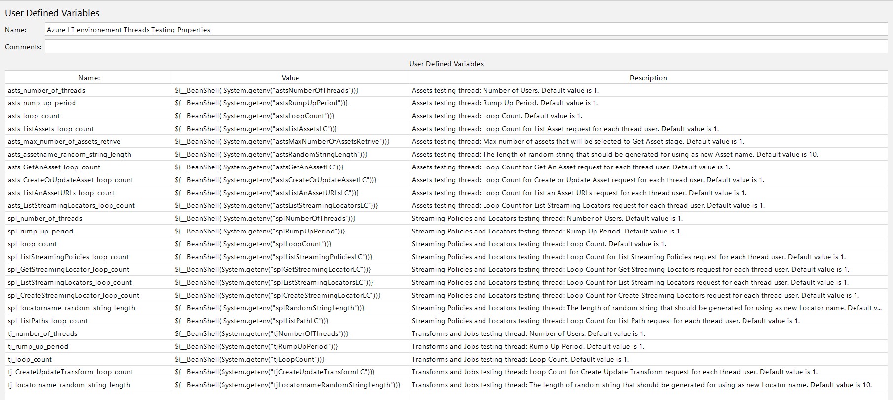

Through the **Azure LT environment Threads Testing Properties** module, the values of variables that have been defined in the **Azure Load Testing** environment are passed. It should be mentioned that it is not necessary to define all declared variables in the **Azure Load Testing** environment. The values of the missing variables will be set to default values via the test script that will be discussed next. Below is a table with all variable names, descriptions and default values.

[Top](#table-of-contents)

#### Table of variables that can be defined via **Azure Load Testing** environment 
| Variable name | Thread | Description | Default value |
|:-:|:-:|:--|:-:|
| astsNumberOfThreads |_Assets testing thread_|Number of Users.|1|
| astsRumpUpPeriod |_Assets testing thread_|Rump Up Period.|1|
| astsLoopCount |_Assets testing thread_|Loop Count.|1|
| astsListAssetsLC |_Assets testing thread_|Loop Count for List Asset request for each thread user.|1|
| astsMaxNumberOfAssetsRetrive |_Assets testing thread_|Max number of assets that will be selected to Get Asset stage.|10|
| astsRandomStringLength |_Assets testing thread_|The length of random string that should be generated for using as new Asset name.|10|
| astsGetAnAssetLC |_Assets testing thread_|Loop Count for Get An Asset request for each thread user.|1|
| astsCreateOrUpdateAssetLC |_Assets testing thread_|Loop Count for Create or Update Asset request for each thread user.|1|
| astsListAnAssetURLsLC |_Assets testing thread_|Loop Count for List an Asset URLs request for each thread user.|1|
| astsListStreamingLocatorsLC |_Assets testing thread_|Loop Count for List Streaming Locators request for each thread user.|1|
| splNumberOfThreads |_Streaming Policies and Locators testing thread_|Number of Users.|1|
| splRumpUpPeriod |_Streaming Policies and Locators testing thread_|Rump Up Period. |1|
| splLoopCount |_Streaming Policies and Locators testing thread_|Loop Count.|1|
| splListStreamingPoliciesLC |_Streaming Policies and Locators testing thread_|Loop Count for List Streaming Policies request for each thread user.|1|
| splGetStreamingLocatorLC |_Streaming Policies and Locators testing thread_|Loop Count for Get Streaming Locators request for each thread user.|1|
| splListStreamingLocatorsLC |_Streaming Policies and Locators testing thread_|Loop Count for List Streaming Locators request for each thread user.|1|
| splCreateStreamingLocatorLC |_Streaming Policies and Locators testing thread_|Loop Count for Create Streaming Locators request for each thread user.|1|
| splRandomStringLength |_Streaming Policies and Locators testing thread_|The length of random string that should be generated for using as new Locator name.|10|
| splListPathLC |_Streaming Policies and Locators testing thread_|Loop Count for List Path request for each thread user.|1|
| tjNumberOfThreads |_Transforms and Jobs testing thread_|Number of Users.|1|
| tjRumpUpPeriod |_Transforms and Jobs testing thread_|Rump Up Period.|1|
| tjLoopCount |_Transforms and Jobs testing thread_|Loop Count.|1|
| tjCreateUpdateTransformLC |_Transforms and Jobs testing thread_|Loop Count for Create Update Transform request for each thread user.|1|
| tjLocatornameRandomStringLength |_Transforms and Jobs testing thread_|The length of random string that should be generated for using as new Locator name.|10|

[Top](#table-of-contents)

## Check Azure LT environment for Thread Properties

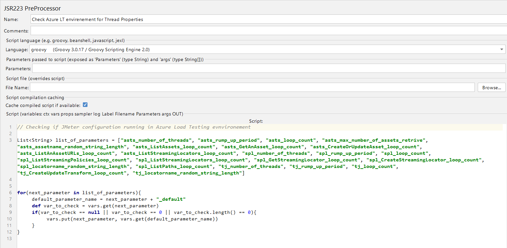

The **Check Azure LT environment for Thread Properties** module implements a script to check the startup configuration in the **Azure Load Testing** environment. 

```groovy
// Checking if JMeter configuration running in Azure Load Testing environment

List<String> list_of_parameters = ["asts_number_of_threads", "asts_rump_up_period", "asts_loop_count", "asts_max_number_of_assets_retrive", "asts_assetname_random_string_length", "asts_ListAssets_loop_count", "asts_GetAnAsset_loop_count", "asts_CreateOrUpdateAsset_loop_count", "asts_ListAnAssetURLs_loop_count", "asts_ListStreamingLocators_loop_count", "spl_number_of_threads", "spl_rump_up_period", "spl_loop_count", "spl_ListStreamingPolicies_loop_count", "spl_ListStreamingLocators_loop_count", "spl_GetStreamingLocator_loop_count", "spl_CreateStreamingLocator_loop_count", "spl_locatorname_random_string_length", "spl_ListPaths_loop_count", "tj_number_of_threads", "tj_rump_up_period", "tj_loop_count", "tj_CreateUpdateTransform_loop_count", "tj_locatorname_random_string_length"]

for(next_parameter in list_of_parameters){
	default_parameter_name = next_parameter + "_default"
	def var_to_check = vars.get(next_parameter)
	if(var_to_check == null || var_to_check == 0 || var_to_check.length() == 0){
		vars.put(next_parameter, vars.get(default_parameter_name))
	}
}
```

As a result of the script, the values of variables that are not defined through the **Azure Load Testing** environment are substituted with default values from the **Default Threads Running Properties** module. 

[Top](#table-of-contents)

## Get AAD Authorization Token — gAuthToken

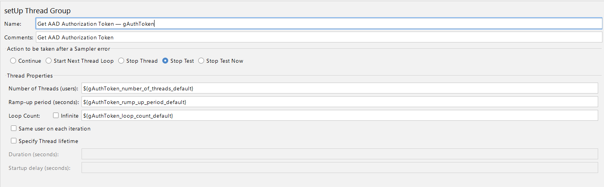

The **Get AAD Authorization Token - gAuthToken** module is used to get an authorization token via a request to the ___/auth/token___ endpoint. Further in the ***Save AccessToken*** script the received token is saved to the global variable **AccessToken** for further use in requests to **RMS Public API**.

```groovy
vars.put("AccessToken", new String(data));
props.put("AccessToken", new String(data));
```

[Top](#table-of-contents)

## Assets testing — asts Threading Group

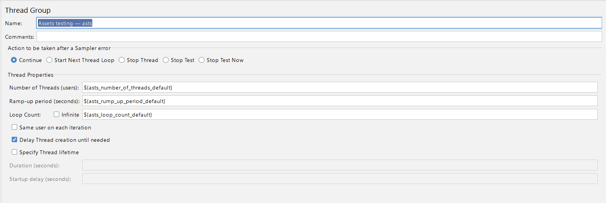

This group implements entity management requests. The group consists of requests to 5 endpoints of **RMS Public API**.

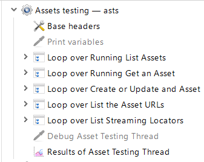 

Each request is wrapped in a **Loop controller** to be able to control the number of corresponding requests. In this way different load testing scenarios can be simulated. Determine the number of iterations of each request for each user through variables from the table above.

[Top](#table-of-contents)

### Prepare request path scripts

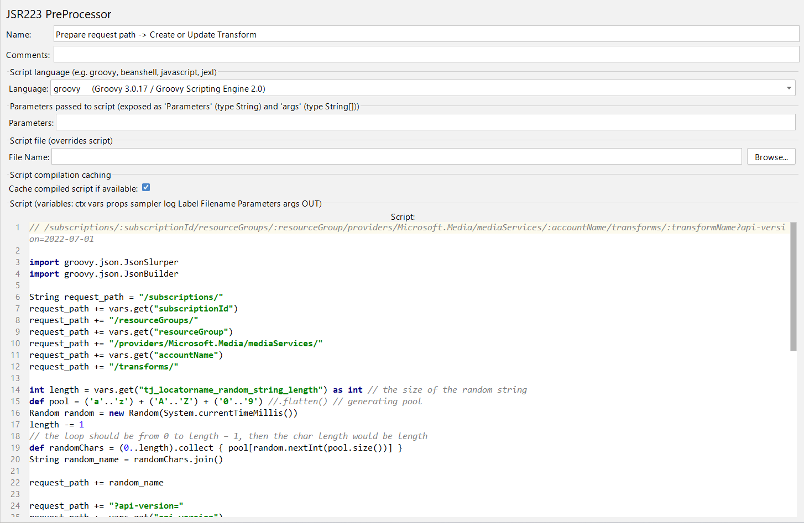

Each request is prepared through the appropriate **JSR223 PreProcessor** module. An example of such a script is given in the code below.

```groovy
// /subscriptions/:subscriptionId/resourceGroups/:resourceGroup/providers/Microsoft.Media/mediaServices/:accountName/transforms/:transformName?api-version=2022-07-01

import groovy.json.JsonSlurper
import groovy.json.JsonBuilder

String request_path = "/subscriptions/"
request_path += vars.get("subscriptionId")
request_path += "/resourceGroups/"
request_path += vars.get("resourceGroup")
request_path += "/providers/Microsoft.Media/mediaServices/"
request_path += vars.get("accountName")
request_path += "/transforms/"

int length = vars.get("tj_locatorname_random_string_length") as int // the size of the random string
def pool = ('a'..'z') + ('A'..'Z') + ('0'..'9') //.flatten() // generating pool
Random random = new Random(System.currentTimeMillis())
length -= 1
// the loop should be from 0 to length – 1, then the char length would be length
def randomChars = (0..length).collect { pool[random.nextInt(pool.size())] }
String random_name = randomChars.join()

request_path += random_name

request_path += "?api-version="
request_path += vars.get("api-version")

vars.put("createUpdateTransformRequestPath", request_path)
vars.put("createdTransformName", random_name)

String base_json = '''{"name":"Default","id":"/subscriptions/2b911ef1-f7dc-4135-b42f-be860bf2411d/resourceGroups/rmp-rg-dima/providers/Microsoft.Media/mediaservices/rmpmsdima/transforms/Default","type":"Microsoft.Media/mediaservices/transforms","properties":{"description":"A simple custom encoding transform with 3 MP4 bitrates","outputs":[{"onError":"StopProcessingJob","relativePriority":"Normal","preset":{"@odata.type":"#Microsoft.Media.StandardEncoderPreset","codecs":[{"@odata.type":"#Microsoft.Media.AacAudio","channels":2,"samplingRate":48000,"bitrate":128000,"profile":"AacLc"},{"@odata.type":"#Microsoft.Media.H264Video","keyFrameInterval":"PT2S","stretchMode":"AutoSize","syncMode":"Auto","sceneChangeDetection":false,"rateControlMode":"ABR","complexity":"Balanced","layers":[{"width":"1280","height":"720","label":"HD-3600kbps","bitrate":3600000,"maxBitrate":3600000,"bFrames":3,"slices":0,"adaptiveBFrame":true,"profile":"Auto","level":"auto","bufferWindow":"PT5S","referenceFrames":3,"crf":23,"entropyMode":"Cabac"},{"width":"960","height":"540","label":"SD-1600kbps","bitrate":1600000,"maxBitrate":1600000,"bFrames":3,"slices":0,"adaptiveBFrame":true,"profile":"Auto","level":"auto","bufferWindow":"PT5S","referenceFrames":3,"crf":23,"entropyMode":"Cabac"},{"width":"640","height":"360","label":"SD-600kbps","bitrate":600000,"maxBitrate":600000,"bFrames":3,"slices":0,"adaptiveBFrame":true,"profile":"Auto","level":"auto","bufferWindow":"PT5S","referenceFrames":3,"crf":23,"entropyMode":"Cabac"}]},{"@odata.type":"#Microsoft.Media.PngImage","stretchMode":"AutoSize","syncMode":"Auto","start":"0%","step":"PT3S","range":"100%","layers":[{"width":"160","height":"90","label":"preview"}]},{"@odata.type":"#Microsoft.Media.JpgImage","stretchMode":"AutoSize","syncMode":"Auto","start":"25%","step":"25%","range":"80%","layers":[{"width":"50%","height":"50%"}]}],"formats":[{"@odata.type":"#Microsoft.Media.Mp4Format","filenamePattern":"Video-{Basename}-{Label}-{Bitrate}{Extension}","outputFiles":[]},{"@odata.type":"#Microsoft.Media.PngFormat","filenamePattern":"{Label}-{Basename}-{Index}{Extension}"},{"@odata.type":"#Microsoft.Media.JpgFormat","filenamePattern":"Thumbnail-{Basename}-{Index}{Extension}"}]}}]}}'''

def base_json_object = new JsonSlurper().parseText(base_json)

base_json_object.put("name", random_name)
base_json_object.put("id", request_path)

def base_json_builder = new JsonBuilder(base_json_object)
def base_json_string = base_json_builder.toString()

vars.put("createUpdateTransformRequestBody", base_json_string)
```

This example provides the most complete version of such scripts, where there is ___preparing the request path, request body, and generating a string of random characters___. All scripts are written in **Apache Groovy**. 

[Top](#table-of-contents)

### The parsers of the responses returned by requests

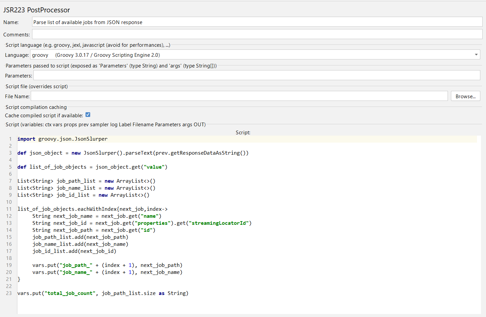

Some queries from the presented test suite return values that should be used in subsequent test phases. To achieve this goal, such requests contain **JSR223 PostProcessor** modules. One of these scripts is given below.

```groovy
import groovy.json.JsonSlurper

def json_object = new JsonSlurper().parseText(prev.getResponseDataAsString())

def list_of_job_objects = json_object.get("value")

List<String> job_path_list = new ArrayList<>()
List<String> job_name_list = new ArrayList<>()
List<String> job_id_list = new ArrayList<>()

list_of_job_objects.eachWithIndex{next_job,index->
	String next_job_name = next_job.get("name")
	String next_job_id = next_job.get("properties").get("streamingLocatorId")
	String next_job_path = next_job.get("id")
	job_path_list.add(next_job_path)
	job_name_list.add(next_job_name)
	job_id_list.add(next_job_id)
	
	vars.put("job_path_" + (index + 1), next_job_path)
	vars.put("job_name_" + (index + 1), next_job_name)
}

vars.put("total_job_count", job_path_list.size as String)
```

In the above example, as a result of parsing the response, the corresponding local and global variables are created, which will be used in subsequent testing steps.  

[Top](#table-of-contents)

### Iterators of requests

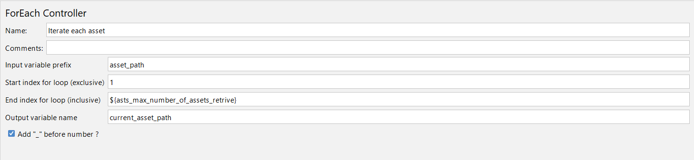

Also, this configuration uses **ForEach** controllers to send a group of requests. This allows you to emulate user behavior in relevant scenarios. The number of iterations for loops can also be controlled through the appropriate variables in the **Azure Load Testing** environment. 

[Top](#table-of-contents)


## Streaming Policies and Locators Testing — spl Threading Group

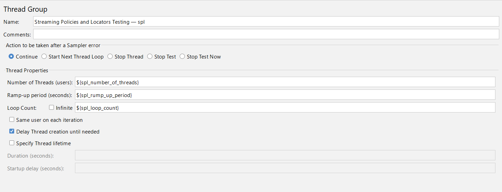

A group of queries for testing streaming policies and locators. There are 5 queries implemented in the group.

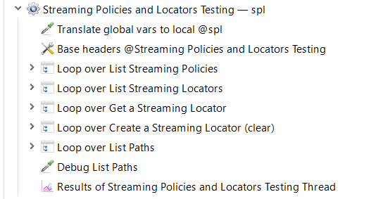

[Top](#table-of-contents)

### The script of translation of global variables to local scope

The configuration of the group starts with the **JSR223 Sampler** module, which implements a script to translate global variables into local scope. The need for this approach is caused by the inability to use global variables in some **Apache JMeter** modules.

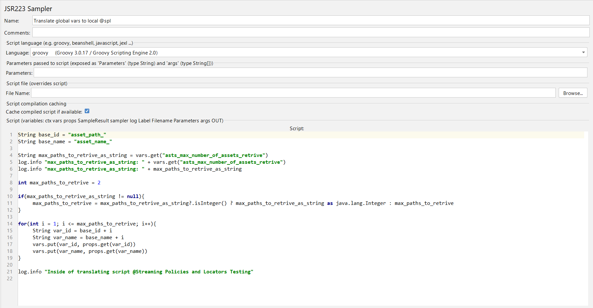

```groovy

String base_id = "asset_path_"
String base_name = "asset_name_"

String max_paths_to_retrive_as_string = vars.get("asts_max_number_of_assets_retrive")

int max_paths_to_retrive = 2

if(max_paths_to_retrive_as_string != null){
	max_paths_to_retrive = max_paths_to_retrive_as_string?.isInteger() ? max_paths_to_retrive_as_string as java.lang.Integer : max_paths_to_retrive
}

for(int i = 1; i <= max_paths_to_retrive; i++){
	String var_id = base_id + i
	String var_name = base_name + i
	vars.put(var_id, props.get(var_id))
	vars.put(var_name, props.get(var_name))
}

log.info "Inside of translating script @Streaming Policies and Locators Testing"
```

## Transforms and Jobs Threading Group

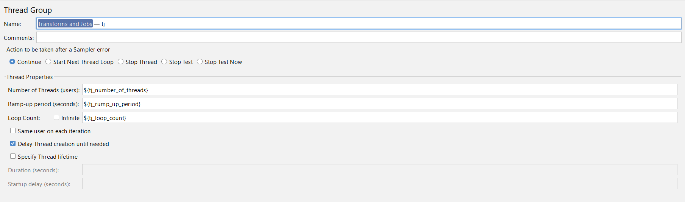

This group tests transform and task manipulation requests. Since many new items are created during the queries, all steps are combined into a single processing loop to achieve the goal of cleaning up the created records after the tests are completed.

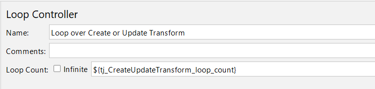

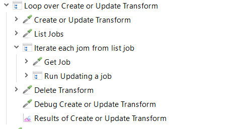

[Top](#table-of-contents)

## Information on metrics

A summary of the metrics provided by the **Azure Load Testing** environment is summarized in the table below.

| Metric at the ALT* | Metric at the [document](https://ravnur.atlassian.net/wiki/spaces/RMP/pages/3671982104/VOD+streaming+load+test+planning+document) | description |
|:--:|:--:|:------:|
|Requests/sec (Avg)|Request Rate|Number of (averaged) requests per second sent to the corresponding endpoints|
|Response time (successful responses)|||
||||
||||
||||
||||
||||
||||
||||
||||
||||
||||

> ALT — Azure Load Testing

[Top](#table-of-contents)