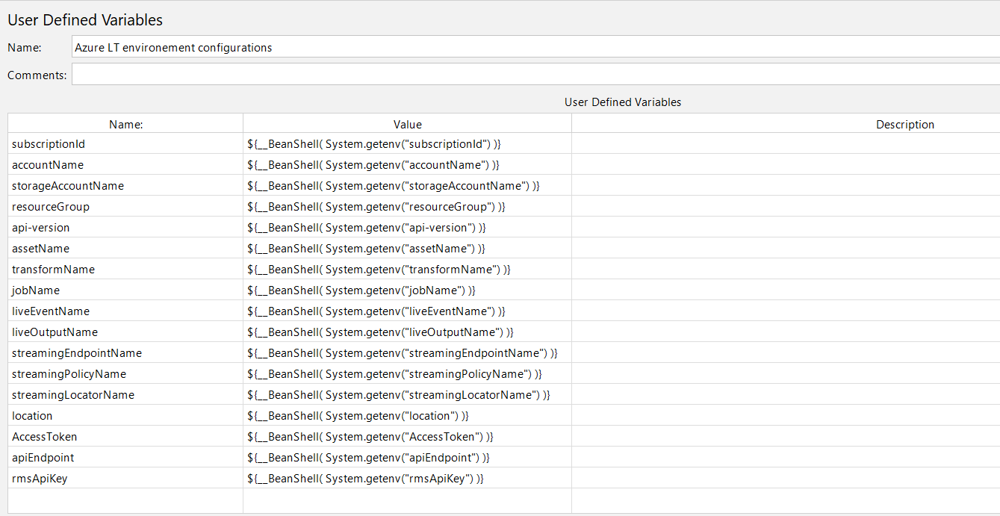
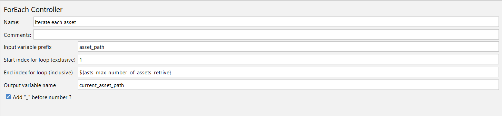
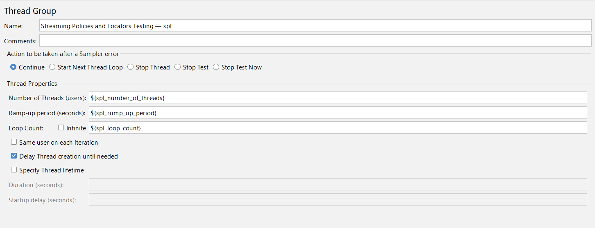
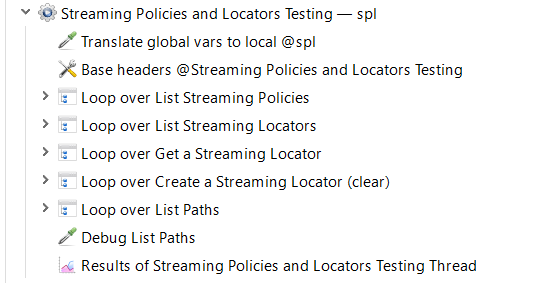
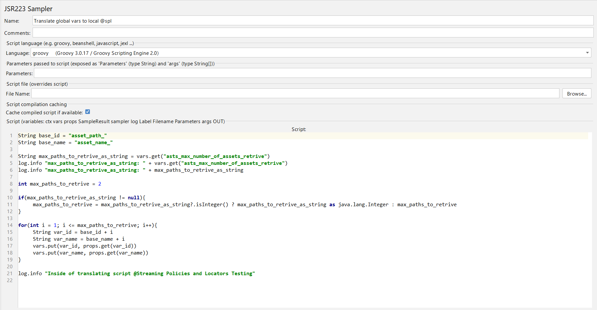
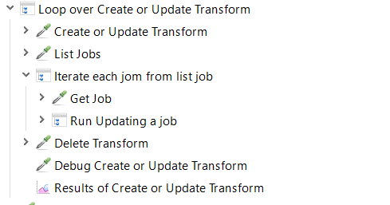

# Apache JMeter configuration for load testing of RMS Public API infrastructure

> Эта конфигурация сделана для нагрузочного тестирования инфраструктуры RMS Public API. Конфигурация сделана с учетом как локального запуска, так и запуска через Azure Load Testing. 

> На данный момент не удалось добиться работы одного скрипта как в локальной среде, так и в среде **Azure Load Testing**. Проблема наблюдается с переменными, значения которых должны управлять параметрами запусков потоков (_Thread_). 

-----------

### Table of contents

- [Apache JMeter configuration for load testing of RMS Public API infrastructure](#apache-jmeter-configuration-for-load-testing-of-rms-public-api-infrastructure)
  - [Default environment configuration](#default-environment-configuration)
  - [Azure LT environment configurations](#azure-lt-environment-configurations)
  - [Check Azure LT environment for configurations](#check-azure-lt-environment-for-configurations)
  - [Default Threads Running Properties](#default-threads-running-properties)
  - [Azure LT environment Threads Testing Properties](#azure-lt-environment-threads-testing-properties)
    - [Таблица переменных определяемых через окружение **Azure Load Testing**](#таблица-переменных-определяемых-через-окружение-azure-load-testing)
  - [Check Azure LT environment for Thread Properties](#check-azure-lt-environment-for-thread-properties)
  - [Get AAD Authorization Token — gAuthToken](#get-aad-authorization-token--gauthtoken)
  - [Assets testing — asts Threading Group](#assets-testing--asts-threading-group)
    - [Prepare request path скрипты](#prepare-request-path-скрипты)
    - [Парсеры возвращаемых запросами ответов](#парсеры-возвращаемых-запросами-ответов)
    - [Итераторы запросов](#итераторы-запросов)
  - [Streaming Policies and Locators Testing — spl Threading Group](#streaming-policies-and-locators-testing--spl-threading-group)
    - [Скрипт трансляции глобальных переменных в локальную зону видимости](#скрипт-трансляции-глобальных-переменных-в-локальную-зону-видимости)
  - [Transforms and Jobs Threading Group](#transforms-and-jobs-threading-group)
  - [Информация по метрикам](#информация-по-метрикам)

-----------

## 

В структуре проекта включены 4 модуля Переменных Определенных Пользователем.

## Default environment configuration


В модуле **Default environment configuration** определены значения по умолчанию для переменных применяемых в запросах к **RMS Public API**. Необходимо отметить, что некоторые их этих переменных не были использованы при составлении этой конфигурации. Так, например, переменные ***assetName***, ***transformName*** и ***jobName*** были проигнорированы, так как использование одного единственного значения для выполнения нагрузочного теста было не достаточно. В этой конфигурации используется генератор строк со случайными символами для создания значений для этих трех переменных. 
Также, из этого модуля удалена переменная, которая в последующем определяется как переменная _Apache JMeter_ в глобальной зоне видимости. 

[Top](#table-of-contents)

## Azure LT environment configurations



В модуле **Azure LT environment configurations** определены имена переменных которые были непосредственно использованы при написании этой конфигурации _Apache JMeter_. Значения для этих переменных берутся из окружения **Azure Load Testing**. При локальном запуске данной конфигурации значения этих переменных устанавливаются в ***null***. 

[Top](#table-of-contents)

## Check Azure LT environment for configurations


В модуле **Check Azure LT environment for configurations** реализован скрипт для проверки запуска конфигурации в среде **Azure Load Testing**. 

```groovy
// Checking if JMeter configuration running in Azure Load Testing environment

List<String> list_of_parameters = ["subscriptionId", "accountName", "storageAccountName", "resourceGroup", "api-version", "assetName", "transformName", "jobName", "liveEventName", "liveOutputName", "streamingEndpointName", "streamingPolicyName", "streamingLocatorName", "location", "AccessToken", "apiEndpoint", "rmsApiKey"]

for(next_parameter in list_of_parameters){
    default_parameter_name = next_parameter + "_default"
    def var_to_check = vars.get(next_parameter)
    if(var_to_check == null || var_to_check == 0 || var_to_check.length() == 0){
        vars.put(next_parameter, vars.get(default_parameter_name))
    }
}
```

В скрипте реализована проверка значений переменных из **Azure LT environment configurations** и в случае локального запуска данной конфигурации значения подставляются из модуля **Default environment configuration**. 

[Top](#table-of-contents)

## Default Threads Running Properties


В модуле **Default Threads Running Properties** определены значения по умолчанию переменных для управлением течения тестирования. Переменные ***gAuthToken_number_of_threads_default***, ***gAuthToken_rump_up_period_default***, ***gAuthToken_loop_count_default*** имеют только значения по умолчанию и не могут быть определены через инфраструктуру **Azure Load Testing**, так как стадия **gAuthToken** объявлена как **setUp Thread** и запускается с целю получения токена авторизации который будет использоваться для выполнения авторизованных запросов. 

[Top](#table-of-contents)

## Azure LT environment Threads Testing Properties


Через модуль **Azure LT environment Threads Testing Properties** передаются значения переменных которые были определены в окружении **Azure Load Testing**. Необходимо отметить, что не обязательно определять все заявленные переменные в окружении **Azure Load Testing**. Значения пропущенных переменных будут установлены в значения по умолчанию через скрипт проверки который будет рассмотрен далее. Ниже приведена таблица со всеми именами переменными, их описаниями и значениями по умолчанию.

[Top](#table-of-contents)

#### Таблица переменных определяемых через окружение **Azure Load Testing**

| Имя переменной                  | Поток                                            | Описание                                                                            | Значение по умолчанию |
|:-------------------------------:|:------------------------------------------------:|:----------------------------------------------------------------------------------- |:---------------------:|
| astsNumberOfThreads             | _Assets testing thread_                          | Number of Users.                                                                    | 1                     |
| astsRumpUpPeriod                | _Assets testing thread_                          | Rump Up Period.                                                                     | 1                     |
| astsLoopCount                   | _Assets testing thread_                          | Loop Count.                                                                         | 1                     |
| astsListAssetsLC                | _Assets testing thread_                          | Loop Count for List Asset request for each thread user.                             | 1                     |
| astsMaxNumberOfAssetsRetrive    | _Assets testing thread_                          | Max number of assets that will be selected to Get Asset stage.                      | 10                    |
| astsRandomStringLength          | _Assets testing thread_                          | The length of random string that should be generated for using as new Asset name.   | 10                    |
| astsGetAnAssetLC                | _Assets testing thread_                          | Loop Count for Get An Asset request for each thread user.                           | 1                     |
| astsCreateOrUpdateAssetLC       | _Assets testing thread_                          | Loop Count for Create or Update Asset request for each thread user.                 | 1                     |
| astsListAnAssetURLsLC           | _Assets testing thread_                          | Loop Count for List an Asset URLs request for each thread user.                     | 1                     |
| astsListStreamingLocatorsLC     | _Assets testing thread_                          | Loop Count for List Streaming Locators request for each thread user.                | 1                     |
| splNumberOfThreads              | _Streaming Policies and Locators testing thread_ | Number of Users.                                                                    | 1                     |
| splRumpUpPeriod                 | _Streaming Policies and Locators testing thread_ | Rump Up Period.                                                                     | 1                     |
| splLoopCount                    | _Streaming Policies and Locators testing thread_ | Loop Count.                                                                         | 1                     |
| splListStreamingPoliciesLC      | _Streaming Policies and Locators testing thread_ | Loop Count for List Streaming Policies request for each thread user.                | 1                     |
| splGetStreamingLocatorLC        | _Streaming Policies and Locators testing thread_ | Loop Count for Get Streaming Locators request for each thread user.                 | 1                     |
| splListStreamingLocatorsLC      | _Streaming Policies and Locators testing thread_ | Loop Count for List Streaming Locators request for each thread user.                | 1                     |
| splCreateStreamingLocatorLC     | _Streaming Policies and Locators testing thread_ | Loop Count for Create Streaming Locators request for each thread user.              | 1                     |
| splRandomStringLength           | _Streaming Policies and Locators testing thread_ | The length of random string that should be generated for using as new Locator name. | 10                    |
| splListPathLC                   | _Streaming Policies and Locators testing thread_ | Loop Count for List Path request for each thread user.                              | 1                     |
| tjNumberOfThreads               | _Transforms and Jobs testing thread_             | Number of Users.                                                                    | 1                     |
| tjRumpUpPeriod                  | _Transforms and Jobs testing thread_             | Rump Up Period.                                                                     | 1                     |
| tjLoopCount                     | _Transforms and Jobs testing thread_             | Loop Count.                                                                         | 1                     |
| tjCreateUpdateTransformLC       | _Transforms and Jobs testing thread_             | Loop Count for Create Update Transform request for each thread user.                | 1                     |
| tjLocatornameRandomStringLength | _Transforms and Jobs testing thread_             | The length of random string that should be generated for using as new Locator name. | 10                    |

[Top](#table-of-contents)

## Check Azure LT environment for Thread Properties


В модуле **Check Azure LT environment for Thread Properties** реализован скрипт для проверки запуска конфигурации в среде **Azure Load Testing**. 

```groovy
// Checking if JMeter configuration running in Azure Load Testing environment

List<String> list_of_parameters = ["asts_number_of_threads", "asts_rump_up_period", "asts_loop_count", "asts_max_number_of_assets_retrive", "asts_assetname_random_string_length", "asts_ListAssets_loop_count", "asts_GetAnAsset_loop_count", "asts_CreateOrUpdateAsset_loop_count", "asts_ListAnAssetURLs_loop_count", "asts_ListStreamingLocators_loop_count", "spl_number_of_threads", "spl_rump_up_period", "spl_loop_count", "spl_ListStreamingPolicies_loop_count", "spl_ListStreamingLocators_loop_count", "spl_GetStreamingLocator_loop_count", "spl_CreateStreamingLocator_loop_count", "spl_locatorname_random_string_length", "spl_ListPaths_loop_count", "tj_number_of_threads", "tj_rump_up_period", "tj_loop_count", "tj_CreateUpdateTransform_loop_count", "tj_locatorname_random_string_length"]

for(next_parameter in list_of_parameters){
    default_parameter_name = next_parameter + "_default"
    def var_to_check = vars.get(next_parameter)
    if(var_to_check == null || var_to_check == 0 || var_to_check.length() == 0){
        vars.put(next_parameter, vars.get(default_parameter_name))
    }
}
```

В результате работы скрипта значения переменных не определенных через окружение **Azure Load Testing** подставляются значениями по умолчанию из модуля **Default Threads Running Properties**.

[Top](#table-of-contents)

## Get AAD Authorization Token — gAuthToken


Модуль **Get AAD Authorization Token — gAuthToken** служит для получения токена авторизации через запрос к эндпоинту ___/auth/token___. Далее в скрипте ***Save AccessToken*** полученный токен сохраняется в глобальную переменную **AccessToken** для дальнейшего использования в запросах к **RMS Public API**.

```groovy
vars.put("AccessToken", new String(data));
props.put("AccessToken", new String(data));
```

[Top](#table-of-contents)

## Assets testing — asts Threading Group


В этой группе реализованы запросы управления сущностями. Группа состоит из запросов к 5 эндпоинтам **RMS Public API**. 

 

Каждый запрос обернут в Loop controller для возможности управления количеством соответствующих запросов. Таким образом можно смоделировать различные сценарии нагрузочного тестирования. Определить количество итераций каждого запроса для каждого пользователя необходимо производить через переменные из таблицы выше. 

[Top](#table-of-contents)

### Prepare request path скрипты


Каждый запрос подготавливается через соответствующий модуль **JSR223 PreProcessor**. Пример такого скрипта приведен в коде ниже.

```groovy
// /subscriptions/:subscriptionId/resourceGroups/:resourceGroup/providers/Microsoft.Media/mediaServices/:accountName/transforms/:transformName?api-version=2022-07-01

import groovy.json.JsonSlurper
import groovy.json.JsonBuilder

String request_path = "/subscriptions/"
request_path += vars.get("subscriptionId")
request_path += "/resourceGroups/"
request_path += vars.get("resourceGroup")
request_path += "/providers/Microsoft.Media/mediaServices/"
request_path += vars.get("accountName")
request_path += "/transforms/"

int length = vars.get("tj_locatorname_random_string_length") as int // the size of the random string
def pool = ('a'..'z') + ('A'..'Z') + ('0'..'9') //.flatten() // generating pool
Random random = new Random(System.currentTimeMillis())
length -= 1
// the loop should be from 0 to length – 1, then the char length would be length
def randomChars = (0..length).collect { pool[random.nextInt(pool.size())] }
String random_name = randomChars.join()

request_path += random_name

request_path += "?api-version="
request_path += vars.get("api-version")

vars.put("createUpdateTransformRequestPath", request_path)
vars.put("createdTransformName", random_name)

String base_json = '''{"name":"Default","id":"/subscriptions/2b911ef1-f7dc-4135-b42f-be860bf2411d/resourceGroups/rmp-rg-dima/providers/Microsoft.Media/mediaservices/rmpmsdima/transforms/Default","type":"Microsoft.Media/mediaservices/transforms","properties":{"description":"A simple custom encoding transform with 3 MP4 bitrates","outputs":[{"onError":"StopProcessingJob","relativePriority":"Normal","preset":{"@odata.type":"#Microsoft.Media.StandardEncoderPreset","codecs":[{"@odata.type":"#Microsoft.Media.AacAudio","channels":2,"samplingRate":48000,"bitrate":128000,"profile":"AacLc"},{"@odata.type":"#Microsoft.Media.H264Video","keyFrameInterval":"PT2S","stretchMode":"AutoSize","syncMode":"Auto","sceneChangeDetection":false,"rateControlMode":"ABR","complexity":"Balanced","layers":[{"width":"1280","height":"720","label":"HD-3600kbps","bitrate":3600000,"maxBitrate":3600000,"bFrames":3,"slices":0,"adaptiveBFrame":true,"profile":"Auto","level":"auto","bufferWindow":"PT5S","referenceFrames":3,"crf":23,"entropyMode":"Cabac"},{"width":"960","height":"540","label":"SD-1600kbps","bitrate":1600000,"maxBitrate":1600000,"bFrames":3,"slices":0,"adaptiveBFrame":true,"profile":"Auto","level":"auto","bufferWindow":"PT5S","referenceFrames":3,"crf":23,"entropyMode":"Cabac"},{"width":"640","height":"360","label":"SD-600kbps","bitrate":600000,"maxBitrate":600000,"bFrames":3,"slices":0,"adaptiveBFrame":true,"profile":"Auto","level":"auto","bufferWindow":"PT5S","referenceFrames":3,"crf":23,"entropyMode":"Cabac"}]},{"@odata.type":"#Microsoft.Media.PngImage","stretchMode":"AutoSize","syncMode":"Auto","start":"0%","step":"PT3S","range":"100%","layers":[{"width":"160","height":"90","label":"preview"}]},{"@odata.type":"#Microsoft.Media.JpgImage","stretchMode":"AutoSize","syncMode":"Auto","start":"25%","step":"25%","range":"80%","layers":[{"width":"50%","height":"50%"}]}],"formats":[{"@odata.type":"#Microsoft.Media.Mp4Format","filenamePattern":"Video-{Basename}-{Label}-{Bitrate}{Extension}","outputFiles":[]},{"@odata.type":"#Microsoft.Media.PngFormat","filenamePattern":"{Label}-{Basename}-{Index}{Extension}"},{"@odata.type":"#Microsoft.Media.JpgFormat","filenamePattern":"Thumbnail-{Basename}-{Index}{Extension}"}]}}]}}'''

def base_json_object = new JsonSlurper().parseText(base_json)

base_json_object.put("name", random_name)
base_json_object.put("id", request_path)

def base_json_builder = new JsonBuilder(base_json_object)
def base_json_string = base_json_builder.toString()

vars.put("createUpdateTransformRequestBody", base_json_string)
```

В этом примере приведен наиболее полная версия подобных скриптов, где есть ___подготовка пути запроса, тела запроса, и генерации строки из случайных символов___. Все скрипты написаны на языке **Apache Groovy**. 

[Top](#table-of-contents)

### Парсеры возвращаемых запросами ответов


Некоторые запросы из представленного набора тестов возвращают значения, которые должны быть использованы в последующих этапах тестирования. Для достижения этой цели такие запросы содержат модули **JSR223 PostProcessor**. Один из таких скриптов приведен ниже.

```groovy
import groovy.json.JsonSlurper

def json_object = new JsonSlurper().parseText(prev.getResponseDataAsString())

def list_of_job_objects = json_object.get("value")

List<String> job_path_list = new ArrayList<>()
List<String> job_name_list = new ArrayList<>()
List<String> job_id_list = new ArrayList<>()

list_of_job_objects.eachWithIndex{next_job,index->
    String next_job_name = next_job.get("name")
    String next_job_id = next_job.get("properties").get("streamingLocatorId")
    String next_job_path = next_job.get("id")
    job_path_list.add(next_job_path)
    job_name_list.add(next_job_name)
    job_id_list.add(next_job_id)

    vars.put("job_path_" + (index + 1), next_job_path)
    vars.put("job_name_" + (index + 1), next_job_name)
}

vars.put("total_job_count", job_path_list.size as String)
```

В приведенном примере в результате парсинга ответа создаются соответствующие локальные и глобальные переменные, которые будут использованы в последующих этапах тестирования.  

[Top](#table-of-contents)

### Итераторы запросов



Также, в данной конфигурации использованы контроллеры цикла для отправки группы запросов. Это позволяет эмулировать поведение пользователя в соответствующих сценариях. Количеством итерация для циклов также можно управлять через соответствующие переменные в среде **Azure Load Testing**. 

[Top](#table-of-contents)

## Streaming Policies and Locators Testing — spl Threading Group



Группа запросов тестирования политик вещания и локаторов. В группе реализованы 5 запросов.



[Top](#table-of-contents)

### Скрипт трансляции глобальных переменных в локальную зону видимости

Конфигурация группы начинается с модуля **JSR223 Sampler** в котором реализован скрипт трансляции глобальных переменных в локальную зону видимости. Необходимость в таком подходе обуславливается не возможностью использования глобальных переменных в некоторых модулях **Apache JMeter**.



```groovy
String base_id = "asset_path_"
String base_name = "asset_name_"

String max_paths_to_retrive_as_string = vars.get("asts_max_number_of_assets_retrive")

int max_paths_to_retrive = 2

if(max_paths_to_retrive_as_string != null){
    max_paths_to_retrive = max_paths_to_retrive_as_string?.isInteger() ? max_paths_to_retrive_as_string as java.lang.Integer : max_paths_to_retrive
}

for(int i = 1; i <= max_paths_to_retrive; i++){
    String var_id = base_id + i
    String var_name = base_name + i
    vars.put(var_id, props.get(var_id))
    vars.put(var_name, props.get(var_name))
}

log.info "Inside of translating script @Streaming Policies and Locators Testing"
```

[Top](#table-of-contents)

## Transforms and Jobs Threading Group


В этой группе тестируются запросы манипуляции с трансформами и задачами. Так как во время запросов создаются множество новых элементов, все этапы объединены в единственную цикл обработки для достижения цели очистки созданных записей после завершения тестов.  




[Top](#table-of-contents)

## Информация по метрикам

Краткая информация по метрикам предоставляемым окружением Azure Load Testing приведена в таблице. 

| Метрика в ALT*                       | Метрика в [документе](https://ravnur.atlassian.net/wiki/spaces/RMP/pages/3671982104/VOD+streaming+load+test+planning+document) | Описание                                                                              |
|:------------------------------------:|:------------------------------------------------------------------------------------------------------------------------------:|:-------------------------------------------------------------------------------------:|
| Requests/sec (Avg)                   | Request Rate                                                                                                                   | Количество (усредненное) запросов в секунду отправленных на соответствующие эндпоинты |
| Response time (successful responses) |                                                                                                                                |                                                                                       |
|                                      |                                                                                                                                |                                                                                       |
|                                      |                                                                                                                                |                                                                                       |
|                                      |                                                                                                                                |                                                                                       |
|                                      |                                                                                                                                |                                                                                       |
|                                      |                                                                                                                                |                                                                                       |
|                                      |                                                                                                                                |                                                                                       |
|                                      |                                                                                                                                |                                                                                       |
|                                      |                                                                                                                                |                                                                                       |
|                                      |                                                                                                                                |                                                                                       |
|                                      |                                                                                                                                |                                                                                       |

> ALT — Azure Load Testing

[Top](#table-of-contents)